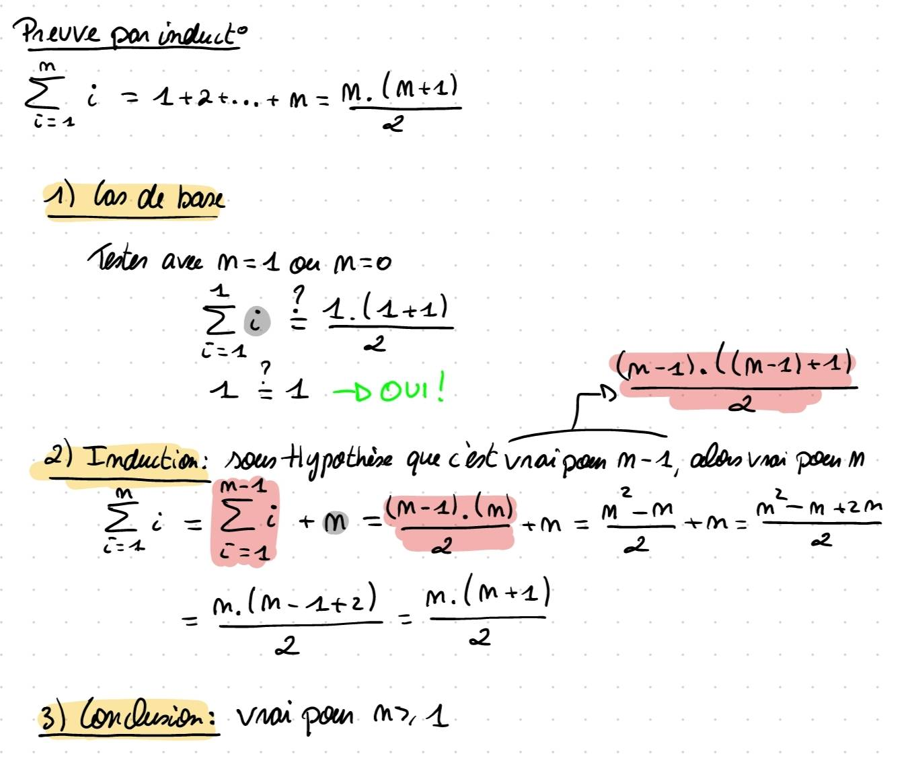

# BE-1103: Ressources

> Accessible jusqu'au 31/08/2025

## Séance 1

> Powerpoint: [BE1-1103](https://uclouvain-my.sharepoint.com/:p:/g/personal/arthur_deneyer_student_uclouvain_be/ESafe8ZlXQJHtZtkMkx3y-EBY6sRSQkUoAn52nzFMDox3A?e=drF6OJ)

## Séance 2

> Powerpoint: [BE2-1103](https://uclouvain-my.sharepoint.com/:p:/g/personal/arthur_deneyer_student_uclouvain_be/EYn9acZKGLNLoAkbzZ5QrMQBPl0C3VwXCYz1PQmgc6j0Og?e=PquMPY)

## Séance 3

> Powerpoint: [BE3-1103](https://uclouvain-my.sharepoint.com/:p:/g/personal/arthur_deneyer_student_uclouvain_be/ET3-366scJpLmz02s9Rw95oBsmLDgwO1G6TAPK4TKDTfkw?e=uVd20w)

## Séance 4

> Powerpoint: [BE4-1103](https://uclouvain-my.sharepoint.com/:p:/g/personal/arthur_deneyer_student_uclouvain_be/EUB1m03RYlBDlJ0-HOXNZOUB461BH-uh3VFnNpveExTSrg?e=JbyEnj)


### Preuve par induction 


#### Exo partie 2:
# Exo sur les classes abstraires, interfaces, polymorphisme, héritage et délégation 

# Objectif
En partant du code suivant: 
```java
public class exercices {
    public static void main(String[] args) {
        Voiture mercedesAMG = new Mercedes("AMG", 240);
        Voiture audiA4 = new Audi("A4", 210);
        Voiture touktouk = new ToukTouk("vMax", 300);

        Voiture[] mesVoiture2s = new Voiture[] {mercedesAMG, audiA4, touktouk};

        Arrays.sort(mesVoiture2s);
        System.out.println("Tri par rapport au critère par défaut (la vitesses)");
        System.out.println(Arrays.deepToString(mesVoiture2s));
        System.out.println("\n\nTri par rapport au critère personnalisé (nbr roues)");
        Arrays.sort(mesVoiture2s, new RouesVoitureComparator());
        System.out.println(Arrays.deepToString(mesVoiture2s));

    }
}
```
Ton but est d'avoir la sortie suivante:
```
Tri par rapport au critère par défaut (la vitesses)
[Mercedes AMG, Audi A4, ToukTouk vMax]

Tri par rapport au critère personnalisé (nbr roues)
[ToukTouk vMax, Mercedes AMG, Audi A4]
```

Pour cela, tu dois:
1. Création de la classe abstraite `Voiture`:
    * Elle implémente la classe `Comparable`
    * Elle a trois attributs (`marque`, `maxSpeed` et `nombreDeRoues`)
    * Elle a deux constructeurs, un reliant ces 2 attributs et mettant une valeur par défaut à `nbreDeRoues` et l'autre reliant directement les 3 attributs)
    * Elle définit une méthode abstraite getInfo()
2. 3 classes `Mercedes`, `Audi` et `ToukTouk` qui étende `Voiture`
   * Il faut y ajouter un attribut `model`, a assigné dans un constructeur
   * Il faut aussi forcément appeler `super()` quelque part 
   * Il faut ajouter toutes les méthodes nécessaires de l'héritage
   * Il faut Override la méthode `toString` qui indique la marque et le modèle
   * La comparaison se fait par rapport à la vitesse de la voiture
3. 1 classe `RouesVoitureComparator` qui implémente `Comparator`
   * La comparaison se fait par rapport au nombre de roues


#### Iterateur sur un arbre (exemple) 

```java
package part_iv;

import java.lang.reflect.Array;
import java.util.ArrayList;
import java.util.Arrays;
import java.util.ConcurrentModificationException;
import java.util.Iterator;

public class TreeIterator implements Iterable<Integer> {
    Tree treeHead;

    public TreeIterator() {
        createTree();
        // ArrayList<Integer> myTreeAsList = new ArrayList<>();
        // treeHead.addPrefixOrder(myTreeAsList);
        // System.out.println(Arrays.deepToString(myTreeAsList.toArray()));
    }


    @Override
    public Iterator<Integer> iterator() {
        ArrayList<Integer> myTreeAsList = new ArrayList<>();
        treeHead.addPrefixOrder(myTreeAsList);

        return new Iterator<Integer>() {

            int index = 0;
            int init_size = myTreeAsList.size();

            @Override
            public boolean hasNext() {
                if (init_size != myTreeAsList.size()) throw new ConcurrentModificationException();
                return index < myTreeAsList.size();
            }

            @Override
            public Integer next() {
                return myTreeAsList.get(index++);
            }
        };
    }

    private void createTree() {
        Tree firstLeft = new Tree(2, null, null);
        Tree firstRight = new Tree(3, null, null);
        treeHead = new Tree(1, firstLeft, firstRight);
        //      1
        // 2        3
    }

    public static void main(String[] args) {
        TreeIterator treeIterator = new TreeIterator();
        for (Integer integer : treeIterator) {
            System.out.println(integer);
        }
    }

}

class Tree {
    int value;
    Tree left;
    Tree right;

    public Tree(int value, Tree left, Tree right) {
        this.value = value;
        this.left = left;
        this.right = right;
    }

    public void addPrefixOrder(ArrayList<Integer> arrayList) {
        // prefix = noeud - G - D
        
        arrayList.add(value);
        if (left != null) left.addPrefixOrder(arrayList);
        if (right != null) right.addPrefixOrder(arrayList);
    }

]
```
